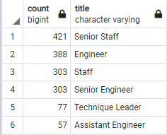

# Pewlett_Hackard_Analysis

## Overview of the analysis
This analysis has a dual purpose: 

1- determine the number of retiring employees per title ;

2- identify employees who are eligible to participate in a mentorship program.

## Results 
We can make 4 observations regarding the output provided. 

1- The management team is pretty young. Only two managers are on the verge of retiring. 

2- On the other hand, a lot of senior engineers might retiring soon. Even if Pewlett_Hackard is a large corporation, having 29 414 senior engineers close from retiring is worrisome. For more details about potential retiring employees, see the figure below. 

3- There are 1549 employees who could be participating in a mentorship program to train new employees. 

4- It seems like there is not enough senior engineers to train new senior engineers. As you can see in the table below, senior engineers come fourth on the number of mentors in the company. 

## Summary

In a close future, 90 398 employees will retire from Pewlett_Hackard. This is a huge number of employees and the company has to make sure that it has enough mentors to fill that void. As we discussed earlier, it feels like there is not enough mentors in some departments (i.e : senior engineering). However, a ratio of 57 assistant engineers (mentors) to 1761 assistant engineers retiring is more than adequate to prepare the corporation for that silver tsunami. In conclusion, some departments are better equiped than others to face that tsunami. 
